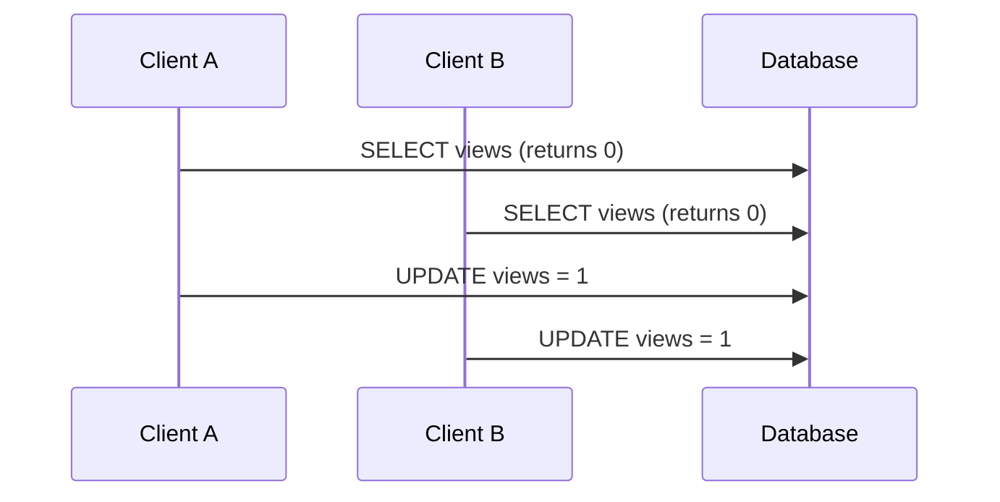

# AI Is Democratizing Code. That isn't necessarily a good thing.

Not everything needs to be a democracy. There is a reason people spend years becoming specialists. Lately, because of AI, everybody on Reddit, Twitter (I will not call it X), and especially LinkedIn, thinks they are a software engineer now. Worse, some engineers in the lower quartile seem to think they can build software far beyond what their actual skill level supports.

To be clear, I do not think I am some genius. I think I am a good engineer. I have worked with great engineers, and I have learned a lot from them. But I am under no illusion that I am them.

This article is a little different. I am going to break down a LinkedIn post from an engineer with 20 years of experience who said he learned a lot from an LLM while writing a SQL query. Because I am not a complete ass, I blurred out the user's name and occupation. There is no reason for embarrassment here.

# The Post In Question

Here is the post:

<p style="text-align: center;">
  
</p>

The start of the post is something I can actually relate to. I have about 10 years of experience, and I would be lying if I said AI had not taught me anything. I am not a complete hater. Just a passionate skeptic.

The problem statement is short and ambiguous: *"When a page loads, you want to increment a view counter."* My first question is: why? I will come back to that, because "count a page view" usually turns out to mean "count some subset of human traffic, exclude bots, and maybe deduplicate refreshes."

For now, let us assume we really do need a counter, and that this counter lives in a database.

## The "Naive" Approach

The poster describes the naive approach as:

1. Read the current value from the database.
2. Increment it in application code.
3. Write it back to the database.

He is correct that this means two database round trips. He is also correct that, at scale, this is wasteful. But I disagree with the idea that this is even a sensible baseline.

This is not merely naive. It is bad.

If two requests hit the system at the same time, this can create a race condition:



Both requests read `0`. Both decide the new value should be `1`. The second write clobbers the first, so you lose an increment. That is not optimization. That is broken.

## The Better Fix

The next part of the post is the actual improvement: let the database do the increment.

```sql
UPDATE products
SET views = views + 1
WHERE id = :id
```

Yes. This is better.

In a mainstream relational database, this avoids the lost-update bug for a simple single-row increment because the database performs the arithmetic inside the `UPDATE` instead of making the application read, calculate, and write. That also cuts out unnecessary application logic.

In pseudocode, a reasonable fire-and-forget write looks more like this:

```text
onPageLoad(productId):
    db.execute(
        "UPDATE products SET views = views + 1 WHERE id = ?",
        productId
    )
```

## This Still Has Limits

Now imagine the same pattern under real load.

If every page view triggers a write, you now have:

- lock contention
- higher write pressure
- slower concurrent access
- trouble for anything else that needs the same row

That is where the "optimization" starts to look less impressive. If the same row also powers checkout, CMS edits, metadata lookup, ads, or anything else, then your little counter update starts interfering with the rest of the system.

This is why I do not like pretending every problem needs a real-time write path.

If all you want is a hit counter, ask why you are not using analytics, batching, a queue, or even just not caring that much. Sometimes the correct solution is to stop inventing infrastructure.

## Taking a Breather

The part that bothered me is not that someone learned something new. I do not care if AI helped clarify a query or taught someone a pattern they had not seen before.

What bothers me is when engineers look at LLM output, assume it is optimal for their use case, and then present it as proof of productivity.

I am currently working on a project that is outside the scope of my normal experience. It involves MPMC queues, SIMD intrinsics, lock-free programming, and other low-level concepts in a language I am still learning. Has AI helped me? Yes. Has AI also confidently suggested code that turned out to be wrong? Also yes. And after review by an actual person, that code was buggy as hell.

That is the problem.

AI is giving engineers a false sense of skill, and for a lot of companies, that is going to bite them in the ass.

For the record, AI did help clean up this text, because my first draft sounded like such an asshole. I may or may not make more posts about AI, as I am increasingly feeling the need to scream into the void.