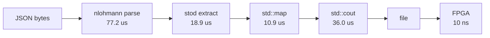
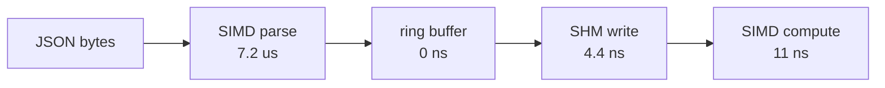

# The Cost of "Free" Implementation

I see this on LinkedIn and Reddit constantly: implementation is free now. AI writes the code, engineers just direct it, and the cost of building software drops to zero.

I am not on the business side of running an engineering organization, but for software of any sort of importance, I cannot see a path to where that is actually true.

One, AI is expensive to use. Two, costs are not only about the accounting of how you value or depreciate software. If the company that I work for just shipped purely vibecoded and vibereviewed software, it would generate a real cost to the bottom line. Users would experience issues, trust in the company and product would decline, and our revenue would be impacted.

The myth that the implementation of software is free is dangerous for any company that chooses to believe this dogma. One of the side effects of this belief is that it becomes very easy to optimize for the wrong thing. AI shifts the actual thinking away from the engineers, or at least for some. Some engineers just do not want to think.

This week's article is way less charged than last week's rage bait. I was served a LinkedIn post about an engineer optimizing an orderbook workflow. It was not nearly as infuriating as the last post, but it did raise concerns that every engineering organization should have about its AI usage.

As a disclaimer, this person did not make any claims about AI being the sole difference maker, or "finding" an optimization. This is purely a critique on how we think about AI, and in the efforts of being constructive, pointing out why this "optimization" is pointless, actually slower, and showing my code, which is more optimal.

# The Problem: Orderbook Processing on an FPGA

The task is to build an orderbook processor and offload calculations to an FPGA. The calculations include Order Book Imbalance (OBI), which is a normalized ratio of bid vs. ask depth at the top of the book, and a rolling volatility estimate with regime classification (low, medium, high).

For those who do not know, an FPGA (Field Programmable Gate Array) can, at a very high level, be thought of as a piece of hardware whose circuits can be altered by code. An FPGA's core logic, which is performed by actual physical circuits, can be reprogrammed by software, in this case Verilog. FPGAs are incredibly fast for data pipelines: timestamping packets, processing data in parallel, and they are used extensively in the finance space. The fit here seems natural.

It should be noted that the author identifies as an FPGA developer, so I think some of my issues with this implementation are a "when you are a hammer, everything looks like a nail" problem.

Because of my interest in both finance and low-latency systems, I started reading the post and looking at the code. Immediately, a few things jumped out at me.

# The Architecture is Defeated Before the FPGA Wakes Up

I should note here that this person says the project is experimental only. But even for an experiment, the optimization is so far out of band that it raises some flags.

This program is ingesting data from Bybit on the BTCUSDT currency pair. Bybit has two types of APIs: one appears to be for institutions, and one for retail. The retail API, the one this project uses, is a JSON WebSocket feed. This is very important, but we will get to that.

If you are in a system that depends on speed, you know how slow JSON can be. This, not to be cliched, puts retail traders at such a disadvantage. Retail can optimize the hell out of their code, which I did and which this person attempted to do, but there is nothing we can do to beat the market makers if they are using binary protocols in colocated datacenters while we are dealing with the public internet and JSON payloads.

Once I saw that this code is having to parse JSON, I knew that the FPGA makes zero difference here. Here is how the data arrives:

```cpp
void on_message(client* c, websocketpp::connection_hdl hdl,
                client::message_ptr msg)
{
    try {
        // ALLOC: json::parse builds a full DOM tree — heap allocates
        // every node, key, and string value. For a 200-level orderbook
        // this is ~1600 heap allocations just for parsing.
        auto j = json::parse(msg->get_payload());

        // ...

        if (type == "snapshot") {
            process_snapshot(data);
        } else if (type == "delta") {
            process_delta(data);
        }
    }
}
```

This project is using nlohmann/json. It is a very respectable, general-purpose JSON parser. It works by building a full DOM tree in memory: every JSON object becomes a `std::map`, every array becomes a `std::vector`, every string becomes a heap-allocated `std::string`. It handles arbitrary schemas, nested structures, unicode escapes, and every edge case in the JSON spec. For most applications, this is exactly what you want.

But it is too heavy-handed for what it is being used for here. The orderbook feed has exactly two conditions we care about: snapshot and delta. Both have the same structure, arrays of `["price", "qty"]` string pairs under `"b"` (bids) and `"a"` (asks). The schema is fixed and known ahead of time.

Here is what the snapshot processing looks like:

```cpp
void process_snapshot(const json& data) {
    std::lock_guard<std::mutex> lock(g_ob_mutex);
    // ALLOC: clear() frees every node in both maps — 400 delete calls.
    g_bids.clear();
    g_asks.clear();

    for (auto& entry : data["b"]) {
        // ALLOC: get<std::string>() copies JSON string into a new
        //        heap-allocated std::string.
        // ALLOC: std::stod() parses the string to double.
        // ALLOC: g_bids[price] allocates a new red-black tree node.
        // SORT:  O(log n) tree rebalancing per insert.
        double price = std::stod(entry[0].get<std::string>());
        double qty   = std::stod(entry[1].get<std::string>());
        if (qty > 0) g_bids[price] = qty;
    }
    for (auto& entry : data["a"]) {
        double price = std::stod(entry[0].get<std::string>());
        double qty   = std::stod(entry[1].get<std::string>());
        if (qty > 0) g_asks[price] = qty;
    }

    write_tick(g_bids, g_asks);
}
```

Now, using a general-purpose parser is fine if the schema of the response changes. But in benchmarks, this approach causes over 800 heap allocations per tick. As soon as you make allocations on the hot path, you are dead.

# Making the Wrong Thing Less Wrong

Instead, we can write our own JSON parser with SIMD intrinsics. Since we know the exact schema, we do not need a DOM. We scan the raw bytes for quote characters, extract `string_view` pairs, and parse them directly into fixed-point integers. No heap allocations, no DOM, no copies.

Note that this was done on my Mac (Apple Silicon), so the intrinsics are NEON, not AVX. The project includes a cross-platform `simd.h` that compiles to SSE2/AVX2 on x86-64 Linux.

The core of the SIMD parser loads 16 bytes at a time and compares against the `"` character in a single instruction:

```cpp
inline std::size_t find_quotes(const char* data, std::size_t len,
                               std::uint32_t* positions,
                               std::size_t max_positions) noexcept
{
    const uint8x16_t q = vdupq_n_u8('"');
    std::size_t count = 0, i = 0;

    for (; i + 16 <= len && count < max_positions; i += 16) {
        uint8x16_t chunk = vld1q_u8(
            reinterpret_cast<const std::uint8_t*>(data + i));
        uint8x16_t cmp = vceqq_u8(chunk, q);
        uint8x8_t narrowed = vshrn_n_u16(
            vreinterpretq_u16_u8(cmp), 4);
        std::uint64_t mask = vget_lane_u64(
            vreinterpret_u64_u8(narrowed), 0);

        while (mask && count < max_positions) {
            unsigned bit = __builtin_ctzll(mask) >> 2;
            positions[count++] =
                static_cast<std::uint32_t>(i + bit);
            mask &= ~(0xFULL << (bit * 4));
        }
    }

    // scalar fallback for remaining bytes
    for (; i < len && count < max_positions; ++i)
        if (data[i] == '"')
            positions[count++] = static_cast<std::uint32_t>(i);
    return count;
}
```

Narrowing the scope of our JSON usage, we can speed up parsing by almost 12x:

| Parser | Time per tick | Heap allocations |
|--------|--------------|-----------------|
| nlohmann/json (theirs) | 80.3 us | ~1600 |
| SIMD parser (mine) | 6.7 us | 0 |

The downside to my approach is that it is brittle to schema changes we are not aware of. If Bybit changes the structure of their orderbook feed, my parser breaks silently. Their parser would handle it gracefully. For a production system, you would want to validate the schema on the first snapshot and then switch to the fast path.

But the point is not that my parser is better. The point is that the FPGA sitting at the end of their pipeline is waiting on 80 microseconds of JSON parsing and memory allocation before it even sees a single byte. My entire pipeline, from raw JSON bytes to OBI and volatility computed, takes 7.5 microseconds. Their JSON parse alone takes 10x longer than my complete system.

Here is what the two pipelines look like side by side:

**Their pipeline: 146.8 us**



**My pipeline: 7.5 us**



The full breakdown:

| Stage | Their code | My code | Speedup |
|-------|-----------|---------|---------|
| JSON parse | 77.2 us | 7.2 us | 10.7x |
| String extract + stod | 18.9 us | 0 (direct to int) | eliminated |
| Map insert (sorting) | 10.9 us | 0 (flat ring buffer) | eliminated |
| Output (stdout vs SHM) | 36.0 us | 4.4 ns | 8,190x |
| **Full pipeline** | **146.8 us** | **7.5 us** | **19.6x** |

Their `std::map` is worth calling out specifically. It uses a red-black tree, which means every insert is a heap allocation for a new tree node, O(log n) comparisons using floating-point arithmetic, and iteration that pointer-chases through scattered memory. Bybit sends levels pre-sorted by price. A flat array with an O(1) append would preserve that order for free.

Their use of `std::mutex` is also a red flag. You generally do not want locks on a hot path, and unless it is a userspace mutex, which in this case it is not, it will cost you latency in ways that are not obvious from reading the code.

First, when a `std::mutex` is contended, acquiring it invokes a syscall. That syscall loads Linux kernel code into the L1 instruction cache, physically evicting the application code you actually want to execute. After the kernel returns, your hot path code has to be fetched back into the instruction cache. Depending on the architecture, this can mean crossing NUMA node boundaries, going to the TLB to resolve virtual-to-physical address mappings at the hardware level, and loading cache lines from a remote memory controller. All of this happens before your code even resumes.

Then there is lock contention itself. If any other thread touches that mutex, your thread blocks. On a system that is supposed to be latency-sensitive, voluntarily handing control to the kernel scheduler is about the worst thing you can do.

My implementation uses atomic operations instead, which are special CPU instructions that guarantee memory ordering without involving the kernel. Atomics are not necessarily always faster than Linux mutexes, which are highly optimized and use futexes to avoid syscalls in the uncontended case. But the critical difference is that an atomic store or load does not flush the instruction cache. Your hot path code stays resident, the CPU pipeline stays full, and you never context-switch into the kernel. For a seqlock pattern where there is one writer and one reader, atomics are the right tool.

# The FPGA Is the Wrong Tool for This Job

The other quirk of this repository is deferring to the FPGA to do the math. I am not an expert in FPGAs, so I will not comment on the Verilog that was written, but from what I know, FPGAs excel at pipelined work, not as an ad-hoc calculator. If I wanted to convert raw network bytes into a format usable in code, I would use an FPGA for that. I would not use one to add 10 numbers together.

The FPGA's OBI calculation takes one clock cycle at 100 MHz, which is 10 nanoseconds. My CPU does the same calculation in 0.25 nanoseconds. The FPGA is 40x slower for this workload, because modern CPUs are incredibly fast at simple scalar arithmetic. An FPGA would make sense here if it were receiving raw binary market data directly on its network pins, parsing a fixed-width protocol in hardware, computing the result, and emitting an order, all without software in the path. That is what the firms actually winning this race are doing. None of those conditions apply here.

# It Is Still the Wrong Thing

Even if we fix every inefficiency in the software, even if we use SIMD parsing, shared memory, lock-free data structures, and vectorized computation, the system is still architecturally defeated.

The WebSocket message arrives over the public internet with 10 to 50 milliseconds of jitter. Whether you process it in 146 microseconds or 7.5 microseconds, you are still tens of milliseconds behind a colocated firm with a direct binary feed. The firms winning this race are not optimizing JSON parsers. They are eliminating JSON entirely.

# My Solution

My implementation computes the same results: OBI, rolling volatility, and regime classification. It is 19.6x faster end to end. Here is why.

## No DOM, No Allocations

Instead of building a full JSON tree in memory, I scan the raw WebSocket payload for quote characters using SIMD intrinsics, extract `string_view` pairs pointing directly into the receive buffer, and parse them into fixed-point integers. Zero heap allocations on the hot path.

```cpp
void OrderBook::process_snapshot(const char* data, std::size_t len)
{
    arrival_ts_ = now_ns();

    bid_levels_.clear();
    ask_levels_.clear();

    static constexpr std::size_t MAX_QUOTES = 2048;
    std::uint32_t qpos[MAX_QUOTES];
    std::size_t qcount = find_quote_positions(data, len, qpos, MAX_QUOTES);

    const char* bids_start = find_side_array(data, len, qpos, qcount, 'b');
    const char* asks_start = find_side_array(data, len, qpos, qcount, 'a');

    if (bids_start) parse_side_simd(data, len, bids_start, bid_levels_);
    if (asks_start) parse_side_simd(data, len, asks_start, ask_levels_);

    write_tick();
}
```

No mutex, no DOM, no `std::string`. The `qpos` array lives on the stack, and `find_quote_positions` fills it using SIMD. The parser walks quote pairs to extract `string_view` slices and feeds them directly into `FastDecimal::parse`, which converts ASCII to `uint32_t` fixed-point in place.

## Fixed-Point from the Start

Their code parses strings to `double` with `std::stod`, stores them in a `std::map`, then converts back to integers with `std::round` for the FPGA. Mine parses strings directly into `uint32_t` fixed-point values. The data never touches a floating-point register.

```cpp
// "61000.5000" → raw_ = 610005000 (4 decimal places, uint32_t)
static bool parse(std::string_view s, FastDecimal& out) noexcept {
    // ...
    out.raw_ = static_cast<Rep>(whole * scale + frac);
    return true;
}
```

## Flat Ring Buffer, Not a Red-Black Tree

Their `std::map` heap-allocates a tree node for every insert and does O(log n) rebalancing with floating-point comparisons. Bybit sends levels pre-sorted by price. I append them to a ring buffer in O(1). Iteration is a contiguous memory walk instead of pointer-chasing through scattered heap nodes.

```cpp
void push(Price4 price, Price4 qty) noexcept {
    std::size_t slot = (head_ + count_) & MASK;  // power-of-2 wrap
    if (count_ == BOOK_DEPTH) {
        slot = head_;
        head_ = (head_ + 1) & MASK;
    } else {
        ++count_;
    }
    prices[slot] = price;
    quantities[slot] = qty;
}
```

No allocations. `MASK` is `BOOK_DEPTH - 1`, so the modulo is a single bitwise AND.

There is a subtlety here worth explaining. The `Levels` struct stores prices and quantities as two separate arrays, not as an array of `{price, qty}` pairs. This is called struct-of-arrays (SoA) layout, as opposed to array-of-structs (AoS).

This matters because of how CPU caches work. When the CPU reads a value from memory, it does not fetch just that value. It fetches an entire cache line, which on most modern hardware is 64 bytes. That cache line is loaded into the L1 cache, which on my machine is 64 KB and can be accessed in about 1-2 nanoseconds. Main memory, by comparison, takes 50-100 nanoseconds. So if the next value you need is already in the cache line you just loaded, it is essentially free.

With AoS layout, if you iterate over all prices, every other element in the cache line is a quantity you do not need. You waste half your cache bandwidth on data you are not using. With SoA, all the prices are contiguous in memory. When you load a cache line of prices, you get 16 prices in one fetch (16 x 4 bytes = 64 bytes), and every single one is useful. The same applies when you iterate quantities.

Their `std::map` is the worst case for cache locality. Each node is a separate heap allocation at an arbitrary memory address. Iterating the map means following a pointer to a random location in memory for every single level. That is a cache miss on almost every access, which means going to L2 or L3 or even main memory each time instead of L1. For 200 levels, that is potentially 200 cache misses, each costing 10-100 nanoseconds, just to read data that could have been a single linear scan.

## Shared Memory with a Seqlock, Not stdout

Their code writes 402 lines of ASCII text to stdout per tick, then flushes. My writer copies the top 5 levels into a POSIX shared memory region protected by a seqlock. The reader process picks it up with two atomic loads and no system calls. The write takes 4.4 nanoseconds. Theirs takes 36 microseconds. I used shared memory here to be roughly analogous to their approach of passing ticks off to the FPGA. In both cases, the writer produces data and a separate consumer reads it. The difference is that mine does it in nanoseconds with zero serialization, while theirs converts integers to ASCII, writes them to a file, and parses them back into integers on the other side.

```cpp
void OrderBook::write_tick() noexcept
{
    if (!shm_) return;

    // odd seq = write in progress
    __atomic_store_n(&shm_->seq, ++seq_, __ATOMIC_RELEASE);

    shm_->write_ts_ns = arrival_ts_;
    shm_->bid_count = static_cast<std::uint32_t>(bid_levels_.size());
    shm_->ask_count = static_cast<std::uint32_t>(ask_levels_.size());

    flush_top5(bid_levels_, shm_->bid_prices, shm_->bid_qtys);
    flush_top5(ask_levels_, shm_->ask_prices, shm_->ask_qtys);

    // even seq = write complete
    __atomic_store_n(&shm_->seq, ++seq_, __ATOMIC_RELEASE);
}
```

The reader spins on `seq` — if it is odd, a write is in progress. If `seq` changed between reading bid and ask data, the snapshot is torn and the reader retries. No locks, no syscalls.

## SIMD Compute

OBI is a horizontal sum of 5 quantities per side, a subtraction, and a division. I use NEON `vaddvq_u32` to sum 4 elements in one instruction plus a scalar add for the fifth. Volatility uses `vmulq_s32` with `vpaddlq_s32` to compute sum-of-squares 4 elements at a time, widening to 64-bit accumulators. The full compute side, SHM write, OBI, and volatility, takes about 11 nanoseconds combined.

```cpp
static std::int32_t compute_obi(const std::uint32_t* bid_qtys,
                                 const std::uint32_t* ask_qtys) noexcept
{
    std::uint32_t sb = simd::hsum_u32x4(bid_qtys) + bid_qtys[4];
    std::uint32_t sa = simd::hsum_u32x4(ask_qtys) + ask_qtys[4];

    std::uint32_t total = sb + sa;
    if (total == 0) return 0;

    // OBI = (bid - ask) / (bid + ask), scaled to [-10000, +10000]
    return static_cast<std::int32_t>(
        (static_cast<std::int64_t>(sb) - static_cast<std::int64_t>(sa)) * 10000
        / static_cast<std::int64_t>(total));
}
```

## Power-of-2 Buffer Sizes

The ring buffer depth is 256, not 200. This means every index wrap is a bitwise AND (`index & 255`) instead of a modulo operation (`index % 200`). Modulo requires an integer division, which on most CPUs takes 20-40 cycles. A bitwise AND takes 1 cycle. This applies to every push and every indexed read. Their code uses 200 as the level count throughout, which is not a power of 2 and forces the compiler to emit a division or a multiply-shift sequence every time they need to wrap an index.

## Only Write What You Need

Their code writes all 200 levels to stdout on every tick. But the FPGA's OBI calculator only reads the top 5, and the volatility calculator only reads the best bid and best ask. The other 195 levels per side are serialized, written, and parsed for nothing. My SHM region contains 5 levels per side, not 200. That is 40 bytes written instead of 3200. This is what brought the SHM write from 60 nanoseconds down to 4.4 nanoseconds.

## No Floating-Point Anywhere

Their pipeline touches the FPU at every stage: `std::stod` to parse strings into doubles, `double` keys in `std::map` for tree comparisons, and `std::round` to convert back to integers for the FPGA. The data starts as an ASCII string, becomes a double, gets used as a map key, then gets rounded back to an integer. That is three type conversions for a value that was always an integer with a decimal point. My pipeline is pure integer arithmetic from the moment the JSON bytes arrive to the final OBI and volatility values. Floating-point operations are not inherently slow on modern CPUs, but they introduce rounding behavior, use a separate register file, and prevent certain compiler optimizations that are available for integer code.

## Stack-Allocated Working Memory

The quote position array, the levels, and all intermediate state live on the stack. Stack allocation is a pointer bump, essentially free. Heap allocation goes through the allocator, which may take locks, search free lists, and touch cold memory. Their code hits the heap on almost every operation: nlohmann builds a DOM tree on the heap, every `get<std::string>()` copies into a new heap-allocated string, every `std::map` insert allocates a tree node on the heap, and `clear()` at the start of each tick frees all 400 of those nodes back to the heap. That is over 2000 allocator round trips per tick.

## Cross-Platform SIMD

The project includes a single `simd.h` header that compiles to NEON intrinsics on ARM (Apple Silicon, Linux aarch64) and SSE2 intrinsics on x86-64 (Linux). The same source code produces optimal instructions for both architectures without `#ifdef` scattered through the codebase.

## No FPGA

The CPU does it all faster. The entire pipeline, from raw JSON bytes arriving to OBI, volatility, and regime classification computed, takes 7.5 microseconds. Their JSON parse alone takes longer than my complete system.

It is still the wrong thing. But it is the wrong thing done faster.

# The Real Takeaway

In conclusion, both implementations are pointless. Mine is 19.6x faster, but it does not matter. The JSON payload arrives over the public internet on a retail WebSocket feed with 10 to 50 milliseconds of jitter. BTCUSDT is one of the most liquid markets in crypto. Arbitrage opportunities in a market like this are measured in microseconds and exploited by firms with colocated servers, direct binary feeds, and FPGAs wired to the exchange's matching engine. By the time either of our systems has finished parsing the JSON, the opportunity is gone. It was gone before the WebSocket frame even left Bybit's servers.

My code is faster. It is also useless for the stated goal. But that is the whole point of this exercise.

AI helped build their system. The code compiles, it connects, it parses, it feeds an FPGA simulator. It has all the vocabulary of a low-latency trading system: FPGA, fixed-point arithmetic, order book imbalance, volatility regimes. It looks fast. But the architecture is fundamentally broken for the stated goal, and AI will not tell you that unless you already know enough to ask.

That is the problem. AI accelerates output, not judgment. And the cost of building the wrong thing is not zero, even if the implementation is "free."

My code is available at [github.com/tedkoomen/blog_code_samples/tree/main/orderbook](https://github.com/tedkoomen/blog_code_samples/tree/main/orderbook). The repository I reviewed is at [github.com/SitaramD/FPGA/tree/main/BTCUSDT](https://github.com/SitaramD/FPGA/tree/main/BTCUSDT).
